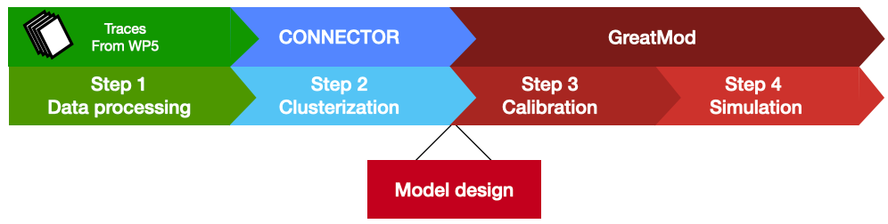
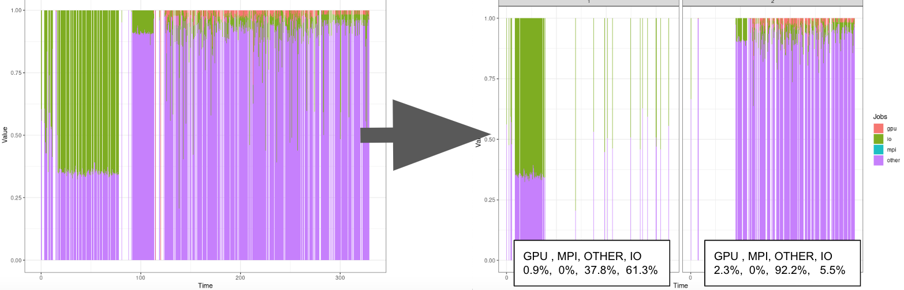

# HPCmodel

# Introduction

In this document we describe how to use the general modeling framework called *GreatMod* ([webpage](https://qbioturin.github.io/epimod/)). In
details, the *GreatMod* novelties and strengths are:

1.  the use of a graphical formalism to simplify the model creation
    phase;
2.  the automatic generation of the deterministic and stochastic process
    underlying the system under study;
3.  the implementation of an R package providing a friendly interface to
    access the analysis techniques implemented in the framework;
4.  a high level of portability and reproducibility granted by the
    containerization (Veiga Leprevost et al. 2017) of all analysis
    techniques implemented in the framework;
5.  a well-defined schema and related infrastructure to allow users to
    easily integrate their own analysis workflow in the framework.

# How to start

Before starting the analysis we have to install 

  (1) GreatSPN GUI, the graphical editor for drawing Petri Nets formalisms, is
available online ([link to install GreatSPN](http://www.di.unito.it/~amparore/mc4cslta/editor.html)), and
it can be installed following the steps showed therein;
  (2) the R package *EPIMOD*, see [how to install](https://qbioturin.github.io/epimod/HowInstall/)
  (3) Docker.

# Workflow

# CLUSTERIZATION

Clusterization using the Kmeans algorithm of a log trace.

# Model design

# Calibration

