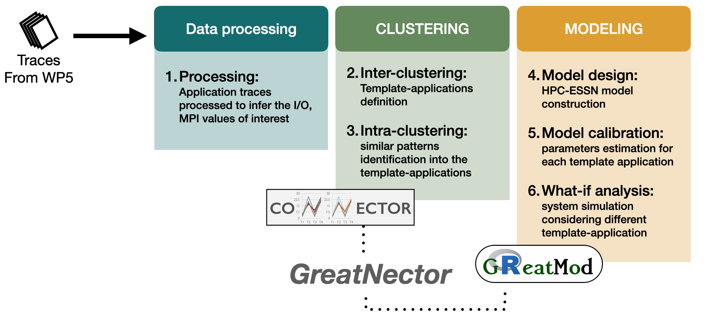

# ADMIRE - HPC model

## Introduction

The developed workflow to model applications behaviour in HPC system is characterised by three main steps: starting from the elaboration of the applications traces generated from WP5, their clusterisation into different groups which will represent the application templates  characterising all the applications with similar behaviour, and the system calibration and simulation to fit the average traces of the application templates. Specifically, the clustering was mainly carried out by exploiting the CONNECTOR package, while the model design, calibration and simulation by using the GreatMod framework. The workflow representing the combination of these two tools is called *GreatNector*.

 Workflow of analysis.

  **Data processing**. Applications traces are generated by the Always-On-Monitoring developed in WP5 based on The TAU performance toolset; these traces are processed by a python script for filtering the not necessaries information, and by aggregating the time spent in a state, and the number of calls of that state in a specific time interval for each application state that we want to consider (for instance IO, MPI, etc).
    
  **Clustering**. We defined two types of clusterizations: inter- and intra-clustering. The former exploits CONNECTOR to fit and cluster the temporal data to highlight differences and similarities among the traces (inter-clustering). The obtained clusters average trace will be exploited to define *template-application* as representative of all the traces that belong to the corresponding cluster. These template-applications will be further clustered to highlight similar patterns into the application through a clustering unsupervised machine learning algorithm, i.e., K-means algorithm (intra-clustering). Therefore, the inter-clustering approach groups applications with similar temporal patterns defining a template-application as representative. Given that the template-applications might be characterised by repetitive patterns, the intra-clustering approach simplifies the template-application into similar parts that will be used to calibrate the model.
    
  **Modeling**. GreatMod is exploited to design the model and simulate the stochastic Markovian process underlying the Petri Net model using the Stochastic Simulation Algorithm encoded in Epimod. We estimated the model unknown parameters to fit a specific log trace through the calibration functionality provided by the framework, which exploits the Generalized Simulated Annealing algorithm for global optimization. In detail, the references were defined as the homogenous groups characterising a template-application, identified from the clustering approaches of Clustering step. The model's parameters identified from  the calibration are used to run different scenario (what-if analysis) exploiting the Stochastic Simulation Algorithm encoded in GreatMod.

## How to start

Before starting the analysis we have to install 

  (0) R ([link to install R tool](https://www.r-project.org/));
  
  (1) GreatSPN GUI, the graphical editor for drawing Petri Nets formalisms, is
available online ([link to install GreatSPN](http://www.di.unito.it/~amparore/mc4cslta/editor.html)), and
it can be installed following the steps showed therein;
 
  (2) the R package *EPIMOD*, see [how to install](https://qbioturin.github.io/epimod/HowInstall/)
  
  (3) the R package *CONNECTOR*, see [how to install](https://qbioturin.github.io/connector/HowInstall/)
  
  (4) Docker ([link to install](https://docs.docker.com/engine/install/ubuntu/)).

## Data Processing

The file generated by the Always-On-Monitoring, storing the application trace is characterised by three columns: the metric name ({name}), its last value change timestamp ({ts}), and its last value ({value}).
The hundreds of metric names in the data are filtered in order to consider: *(i)* {IO}, {MPI}, and {OTHER} percentages of time spent (in each time interval) by the application in each step, and *(ii)* number of {IO} and {MPI} calls. An example traces are stored in the folder *Data*, considering values generated running *QuantumExpresso*, one of the ADMIRE pilot applications, using different numbers of processes.

In this context, let $\mathbf{\mathcal{M}}$ be the set of the metric names that we can exploit to derive the needed information:

  ${tau\_mpi\_total\{metric="time"\}}$: total time spent in MPI;
  
  ${strace\_total\{desc="time"\}}$:  total time spent in syscalls;
  
  ${tau\_mpi\_total\{metric="hits"\} }$: total number of MPI hits;
  
  ${strace\_hits\_total\{scall="read"\}}$: total number of hits in \texttt{read} operations;
  
  ${strace\_hits\_total\{scall="write"\}}$: total number of hits in \texttt{write} operations;
   
  ${strace\_total\{desc="hits"\} }$: total number of syscall hits.

In the folder *DataProcessing* is stored the python script, called **traceArrangement.py**, to manage these type of trace files in order to generate a simplified and arranged file that can exploited by our modelling workflow.

How to run the script:

    ./DataProcessing/traceArrangement.py -i Data/QE-single-node/8.json -p 8 -o QE_8  
    
where the parameters are:

  *-i* the input JSON file to elaborate and plot;

  *-p* the number of MPI processes in measurement;
  
  *-o* the output file name.

The results will be saved in the *Clustering* folder.

## Clustering

The success of inter-clustering relies heavily on the availability of diverse and representative application traces. Therefore, this step will be run when a sufficient amount of data will be available, specifically we need benchmarks with significant I/O patterns that can easily run in the ADMIRE target infrastructures.

Differently, the R script to run the intra-clustering applied to the *QuantumExpresso* application ( as temporary template-applications). In particular, the following R packages are required: *dplyr, factoextra, ggplot2*.

How to run the script:

    Rscript ./Clustering/IntraClustering.R ./Clustering/Data/QE_8Deltas.csv  
    
    
## Modeling

Starting from the HPC-ESSN model stored in the file *Modeling/Net*, we instanced it for modeling the *QuantumExpresso* application with 8 processes. Thus, the colour class $Node$ and $Application$ are set to one colour, since we are considering just one application and one node. Since the intra-clustering identified three patterns into the trace stored in *QE_8Deltas.csv*, then we have to run three model calibration to estimate the transitions parameters associated with each intra-clusters.

The R script to run the calibration is *Modeling/CalibrationMAIN.R*, while *Modeling/Main.R* is the code to run a simulation considering the estimated parameters.

